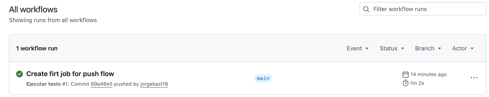
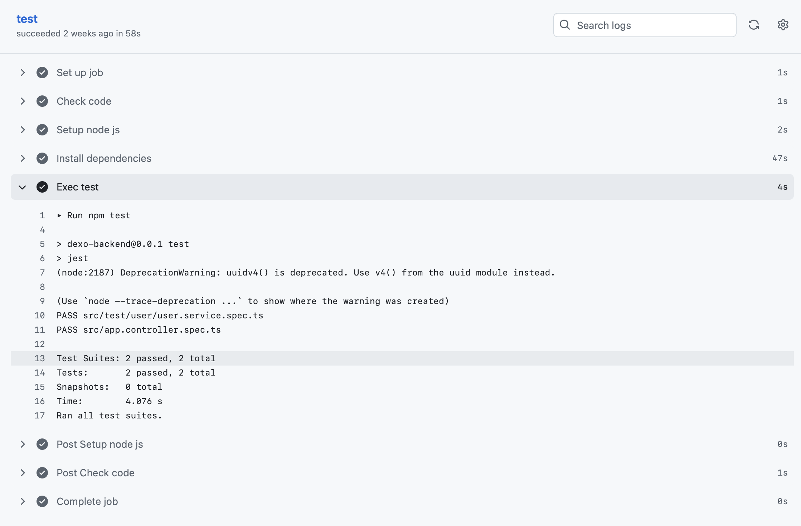

# Hito 2

## Integración Continua

El CI seleccionado es GitHub Actions.

Se integrado GitHub Actions para la integración continua. Dejando configurado un action "test.yml"
que se ejecuta cada vez que se hace un commit en las ramas "main" y "develop".

Se crea un pipeline en la carpeta .github/workflows/test.yml.

La plantilla utilizada es la siguiente:

````YML
name: Ejecutar tests

on:
  push:
    branches:
      - main
      - develop

jobs:
  test:
    runs-on: ubuntu-latest

    steps:
      - name: Check code
        uses: actions/checkout@v3

      - name: Setup node js
        uses: actions/setup-node@v3
        with:
          node-version: '22'

      - name: Install dependencies
        run: npm install

      - name: Exec test
        run: npm test
````
Luego, se prueba la plantilla haciendo un "push" en la rama main del repositorio
ya que en la plantilla se configuró que se ejecutara cada vez que se haga un "push" en la rama main o develop.



## Framework para pruebas
Para los test, he decidido utilizar la librería Jest que es sugerida por el framework NestJS.

He usado la librería Jest por su facilidad de uso y su integración con el framework NestJS. Además que provee
las funcionalidades básica y avanzadas para crear test unitarios que permitan medir la acertividad de las funciones.

## Librería de aserciones

Se utiliza la librería Jest que viene integrada al framework NestJs y Jest.

Esta librería incluye las aserciones básicas y avanzadas para crear test unitarios que permitan medir la acertividad de las funciones.

El primer test que se crea, busca probar la creación de un nuevo usuario. Hasta el momento
no se cuenta con conexión a base de datos, por lo cual se crear un test con datos
básicos que permitan comprobar que el servicio funciona correctamente.

````JS
import { Test, TestingModule } from '@nestjs/testing';
import { UserService } from '../../users/user.service';

describe('UserService', () => {
  let service: UserService;

  beforeEach(async () => {
    const module: TestingModule = await Test.createTestingModule({
      providers: [UserService],
    }).compile();

    service = module.get<UserService>(UserService);
  });

  it('Must be create new user', () => {
    const user = service.create({
      name: 'Juan',
      email: 'juan@example.com',
      password: '123456',
    });

    expect(user).toHaveProperty('id');
    expect(user.email).toBe('juan@example.com');
  });
});
````
## Métodología TDD
Se usa TDD (Test-Driven Development) en lugar de BDD (Behavior-Driven Development) porque TDD se enfoca directamente en
la calidad técnica del código mediante pruebas unitarias que guían el desarrollo. TDD es ideal para estructuras
modulares y componentes técnicos como APIs o servicios, donde el enfoque principal está en que el código funcione
correctamente y sea mantenible.

## Ejecución del pipeline y test


El action de GitHub se ejecuta, realizando diferente pasos como se muestra en la 
imagen a continuación:



Se evidencia que uno de los pasos a seguir de acuerdo al pipeline descrito arriba
son los test, los cuales tienen un resultado positivo ya que pasaron todos los test
en esta ejecución.
