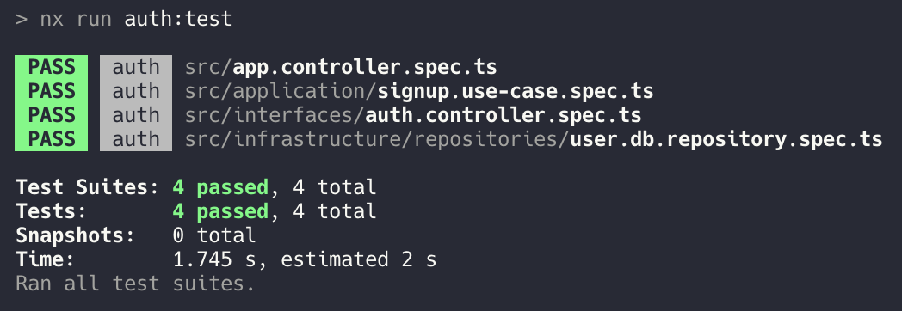
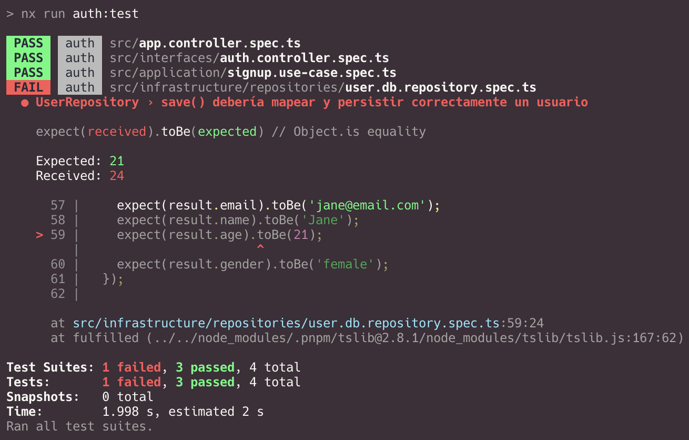
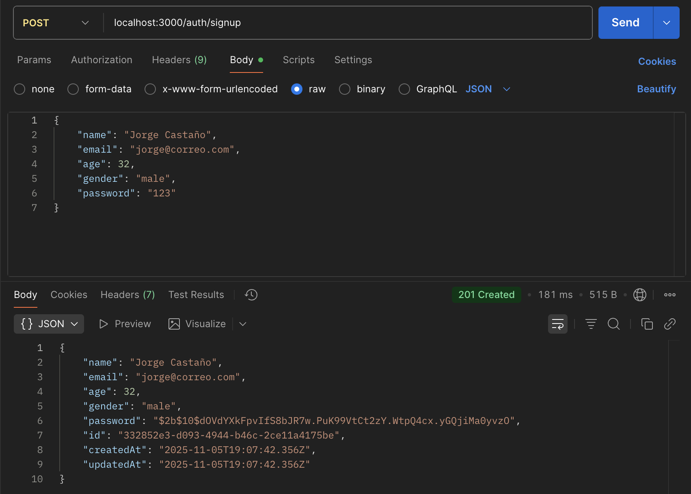
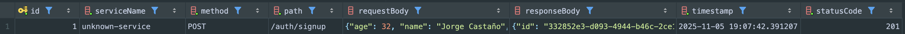
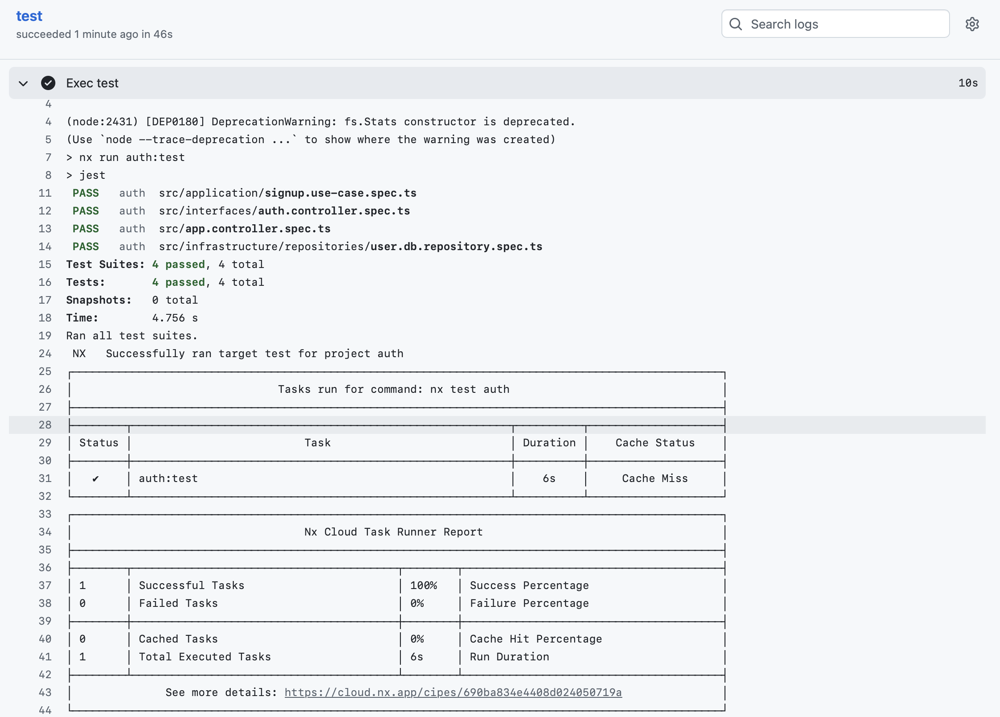

## Hito 3: Diseño de Microservicios

### Elección del framework para los microservicios
Para el desarrollo de los microservicios, se ha optado por utilizar **NestJS**.

Se ha utilizado la librería **NX** para la gestión del monorepo, lo que facilita la organización y el mantenimiento del código.

A continuación, se presenta la estructura del proyecto:

````markdown
├── README.md
├── apps
│   ├── auth
│   │   ├── Dockerfile
│   │   ├── docker-compose.yml
│   │   ├── jest.config.ts
│   │   ├── project.json
│   │   ├── src
│   │   │   ├── app.controller.spec.ts
│   │   │   ├── app.controller.ts
│   │   │   ├── app.module.ts
│   │   │   ├── app.service.ts
│   │   │   ├── application
│   │   │   │   ├── signup.use-case.spec.ts
│   │   │   │   └── signup.use-case.ts
│   │   │   ├── config
│   │   │   │   ├── database.module.ts
│   │   │   │   └── environment.ts
│   │   │   ├── doc
│   │   │   │   ├── hito1.md
│   │   │   │   └── hito2.md
│   │   │   ├── domain
│   │   │   │   ├── models
│   │   │   │   │   └── user.model.ts
│   │   │   │   └── ports
│   │   │   │       └── user.repository.interface.ts
│   │   │   ├── infrastructure
│   │   │   │   ├── entities
│   │   │   │   │   └── user.entity.ts
│   │   │   │   ├── mappers
│   │   │   │   │   └── user.mapper.ts
│   │   │   │   └── repositories
│   │   │   │       ├── user.db.repository.spec.ts
│   │   │   │       └── user.db.repository.ts
│   │   │   ├── interfaces
│   │   │   │   ├── auth.controller.spec.ts
│   │   │   │   ├── auth.controller.ts
│   │   │   │   └── signup.dto.ts
│   │   │   └── main.ts
│   │   ├── tsconfig.app.json
│   │   ├── tsconfig.json
│   │   ├── tsconfig.spec.json
│   │   └── webpack.config.js
│   └── logs
│       ├── Dockerfile
│       ├── jest.config.ts
│       ├── project.json
│       ├── src
│       │   ├── app
│       │   │   ├── app.controller.spec.ts
│       │   │   ├── app.controller.ts
│       │   │   ├── app.module.ts
│       │   │   ├── app.service.spec.ts
│       │   │   └── app.service.ts
│       │   └── main.ts
│       ├── tsconfig.app.json
│       ├── tsconfig.json
│       ├── tsconfig.spec.json
│       └── webpack.config.js
├── docker-compose.yml
├── docs
│   ├── Hito1.md
│   └── Hito2.md
└── jest.config.ts
````
En la estructura del proyecto, se pueden observar dos aplicaciones principales: `auth` y `logs`. Cada una de estas aplicaciones contiene su propia configuración, código fuente y pruebas.

La arquitectura seleccionada es *Hexagonal*, que permite una separación clara entre el dominio de la aplicación y las capas de infraestructura e interfaces. Esto facilita la mantenibilidad, escalabilidad del sistema y las pruebas unitarias.

Por ejemplo, se muestra que se han creado 3 test unitarios:

- `signup.use-case.spec.ts`: Prueba unitaria para el caso de uso de registro de usuarios en la capa de aplicación.
- `user.db.repository.spec.ts`: Prueba unitaria para el repositorio de usuarios en la capa de infraestructura.
- `auth.controller.spec.ts`: Prueba unitaria para el controlador de autenticación en la capa de interfaces.

Esta arquitectura nos permite realizar pruebas por cada capa de la aplicación, asegurando que cada componente funcione correctamente de manera aislada.

### Ejecución de tests unitarios

Se muestra a continuación el resultado de las pruebas unitarias.



Adicionalmente se hace fallar un test para verificar que es fácil testear y detectar errores en el código en componentes específicos. En este caso el test falla en la capa de *repositories*
que pertenece a la capa de infraestructura.



### Logging centralizado
Se ha implementado un sistema de logging centralizado utilizando un microservicio dedicado a la gestión de logs. Este microservicio recibe y almacena los logs generados por otros microservicios.

El microservicio está generado como una lib del monorepo con NX, lo que facilita su integración y reutilización en diferentes partes del sistema.

Se realiza una prueba, enviando una petición desde postman al microservicio de autenticación, que a su vez envía un log al microservicio de logs.



El microservicio de logs recibe y almacena el log enviado por el microservicio de autenticación, confirmando así el correcto funcionamiento del sistema de logging centralizado.

Cómo se muestra en la imagen, el microservicio de logs ha recibido el log con éxito.



Esta tabla de log, está compuesta por los siguientes campos:

- **id**: Identificador único del log.
- **method**: Método HTTP utilizado en la petición (por ejemplo, POST).
- **path**: Endpoint al que se realizó la petición (por ejemplo, /signup).
- **status**: Código de estado HTTP devuelto por el microservicio (por ejemplo, 201).
- **timestamp**: Marca de tiempo que indica cuándo se generó el log.
- **requestBody**: Cuerpo de la petición enviada al microservicio (por ejemplo, datos del usuario).
- **responseBody**: Cuerpo de la respuesta devuelta por el microservicio (por ejemplo, mensaje de éxito).

### Ejecución de test en el pipeline Action de GitHub

Se ha configurado un pipeline de integración continua utilizando GitHub Actions para ejecutar las pruebas unitarias automáticamente en cada push o pull request.

Se conecta Nx Cloud con el repositorio de GitHub para optimizar la ejecución de las tareas y aprovechar el caching distribuido.


