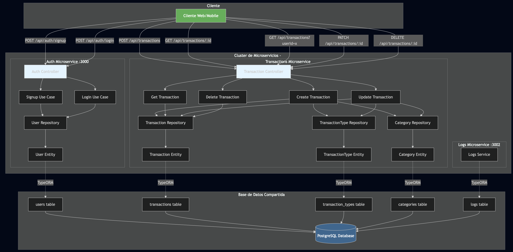

## Hito 4: Composición de Servicios

### Elección del contenedor base:

Para este hito, he optado por utilizar **Docker** como nuestro contenedor base debido a su amplia adopción en la industria, facilidad de uso y robusta comunidad de soporte. Docker nos permite empaquetar nuestras aplicaciones y sus dependencias en contenedores ligeros y portátiles, facilitando la implementación y escalabilidad de nuestros servicios.

````yml
version: "3.8"
services:
  service_name:
    build:
      context: ${AUTH_BUILD_CONTEXT:-../../}
      dockerfile: ${AUTH_DOCKERFILE:-apps/auth/Dockerfile}
      args:
        NODE_ENV: ${NODE_ENV:-production}
    image: ${AUTH_IMAGE:-auth_service:latest}
    container_name: ${AUTH_CONTAINER_NAME:-auth_service}
    ports:
      - "${AUTH_PORT:-3001}:${AUTH_INTERNAL_PORT:-3000}"
    env_file:
      - .env
      - ../../.env
    environment:
      - NODE_ENV=${NODE_ENV:-production}
    restart: on-failure
    networks:
      - dexo_network

networks:
  dexo_network:
    driver: bridge
````

Primero, definimos un servicio llamado `service_name` en nuestro archivo `docker-compose.yml`. Este servicio se construye a partir de un contexto y un Dockerfile específicos, que se pueden personalizar mediante variables de entorno. La imagen resultante se etiqueta como `auth_service:latest`, pero puede variar de acuerdo al microservicio y el contenedor se nombra `auth_service` ó como se defina en las variables de entorno.

La base es un container de JavaScript (Node.js) optimizado para producción, lo que garantiza un entorno estable y eficiente para ejecutar nuestras aplicaciones.

### Dockerfile Base:

Luego, se define **Dockerfile.base** que sirve como plantilla para construir imágenes de Docker para diferentes microservicios. Este Dockerfile utiliza una imagen base de Node.js, instala las dependencias necesarias y copia el código fuente al contenedor.

````Dockerfile
# Etapa de build
FROM node:20-alpine AS builder
WORKDIR /app

# Copia archivos de configuración
COPY package*.json ./
COPY nx.json ./
COPY tsconfig.base.json ./
COPY eslint.config.js jest.preset.js ./

# Copia los apps necesarios
COPY apps/auth ./apps/auth
COPY libs ./libs

# Instala dependencias
RUN npm ci --legacy-peer-deps

# Build de producción con Nx
RUN npx nx build auth --prod

# Etapa final
FROM node:20-alpine
WORKDIR /app

# Copia la aplicación compilada
COPY --from=builder /app/dist/apps/auth ./
COPY --from=builder /app/node_modules ./node_modules

# Si tu app necesita package.json en runtime:
COPY --from=builder /app/package*.json ./

EXPOSE 3000

CMD ["node", "main.js"]
````

Primero, el Dockerfile define una etapa de construcción (`builder`) que utiliza una imagen base de Node.js en Alpine Linux para mantener la imagen ligera. En esta etapa, se copian los archivos de configuración y el código fuente necesario para construir la aplicación.

Luego, se instalan las dependencias utilizando `npm ci` y se ejecuta el comando de build de Nx para compilar la aplicación en modo producción.

Finalmente, en la etapa final, se crea una nueva imagen base de Node.js en Alpine Linux y se copian los archivos compilados desde la etapa de construcción. Se expone el puerto 3000 y se define el comando para iniciar la aplicación. El puerto debe cambiar de acuerdo al microservicio que se esté configurando.

### Justificación de los contenedores elegidos:

1. **Docker**: Es la plataforma de contenedorización más popular y ampliamente utilizada. Su ecosistema robusto y su facilidad de integración con herramientas de CI/CD lo hacen ideal para proyectos modernos.
2. **Node.js**: Dado que nuestras aplicaciones están desarrolladas en JavaScript/TypeScript, Node.js es la elección natural para ejecutar nuestro código en contenedores. La versión Alpine asegura que las imágenes sean ligeras y eficientes.
3. **Multi-stage Builds**: Utilizar multi-stage builds en Docker nos permite optimizar el tamaño de las imágenes finales al separar el proceso de construcción del entorno de ejecución, lo que resulta en contenedores más pequeños y seguros.

En la siguiente imagen se describen los clústeres de servicios que componen la arquitectura de la aplicación:



En la parte de arriba podemos observar los endpoints de los servicios que son expuestos al usuario final a través del API Gateway. Estos servicios se comunican internamente con otros microservicios para cumplir con las funcionalidades requeridas.

Luego, se ve el cluestering conformado por los microservicios principales (Auth y Transactions). Ambos microservicios tienen una arquitectura hexagonal que les permite interactuar con otros servicios y bases de datos de manera independiente.

Finalmente, en la parte inferior se encuentran los servicios de soporte como las bases de datos (PostgreSQL).

Es decir, que cada cluster es un contenedor independiente que se comunica con otros contenedores a través de la red **dexo_network** definida en Docker Compose. Esta arquitectura modular facilita el mantenimiento, escalabilidad y despliegue de la aplicación en diferentes entornos.


