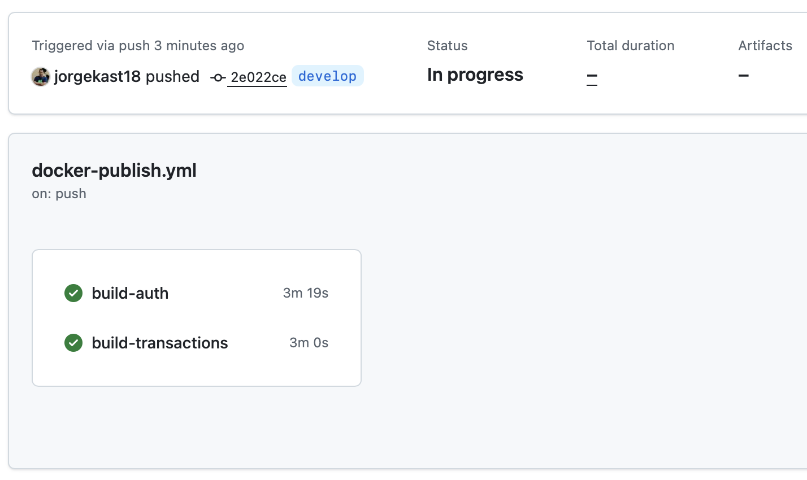
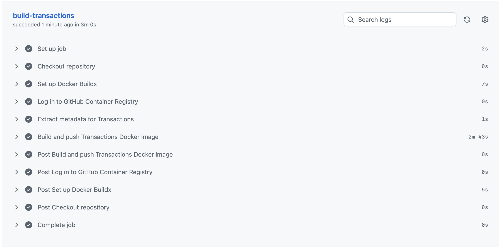
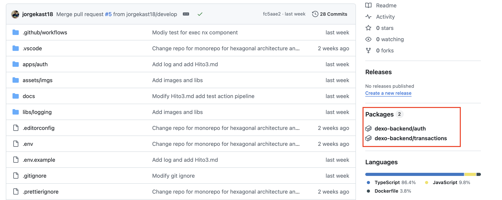
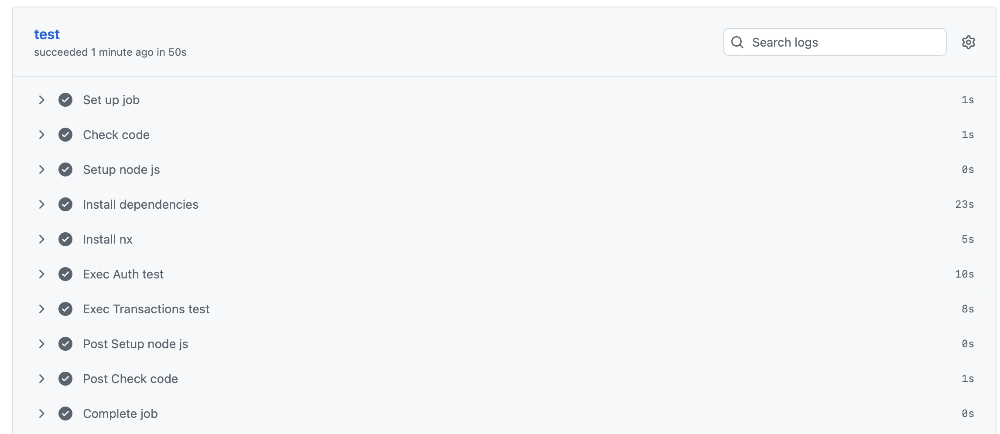
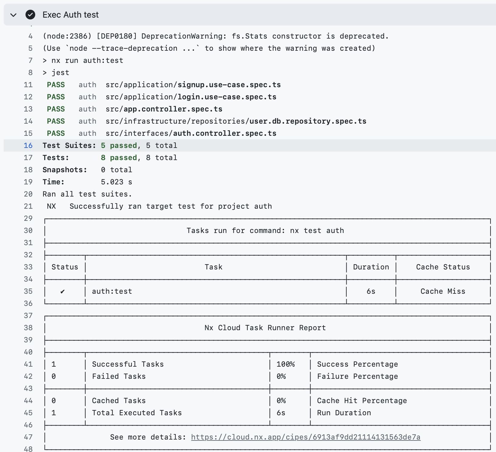
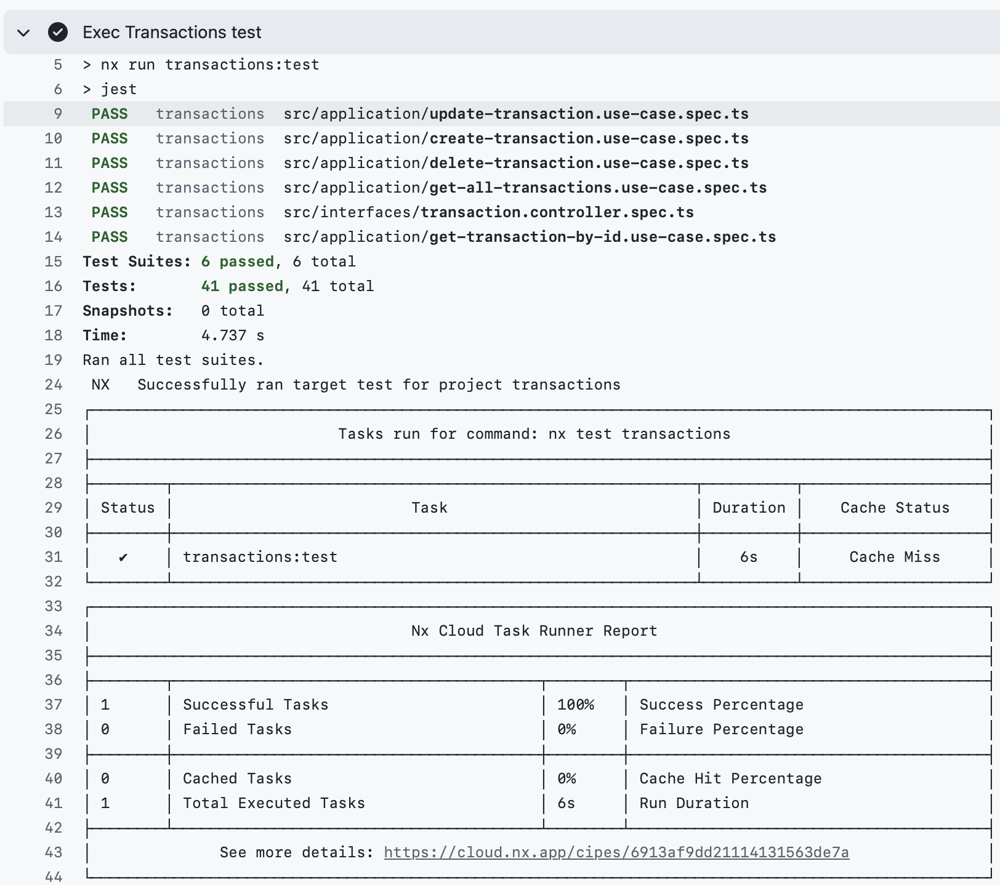

## Hito 4: Composición de Servicios

### Elección del contenedor base:

Para este hito, he optado por utilizar **Docker** como nuestro contenedor base debido a su amplia adopción en la industria, facilidad de uso y robusta comunidad de soporte. Docker nos permite empaquetar nuestras aplicaciones y sus dependencias en contenedores ligeros y portátiles, facilitando la implementación y escalabilidad de nuestros servicios.

````yml
version: "3.8"
services:
  service_name:
    build:
      context: ${AUTH_BUILD_CONTEXT:-../../}
      dockerfile: ${AUTH_DOCKERFILE:-apps/auth/Dockerfile}
      args:
        NODE_ENV: ${NODE_ENV:-production}
    image: ${AUTH_IMAGE:-auth_service:latest}
    container_name: ${AUTH_CONTAINER_NAME:-auth_service}
    ports:
      - "${AUTH_PORT:-3001}:${AUTH_INTERNAL_PORT:-3000}"
    env_file:
      - .env
      - ../../.env
    environment:
      - NODE_ENV=${NODE_ENV:-production}
    restart: on-failure
    networks:
      - dexo_network

networks:
  dexo_network:
    driver: bridge
````

Primero, definimos un servicio llamado `service_name` en nuestro archivo `docker-compose.yml`. Este servicio se construye a partir de un contexto y un Dockerfile específicos, que se pueden personalizar mediante variables de entorno. La imagen resultante se etiqueta como `auth_service:latest`, pero puede variar de acuerdo al microservicio y el contenedor se nombra `auth_service` ó como se defina en las variables de entorno.

La base es un container de JavaScript (Node.js) optimizado para producción, lo que garantiza un entorno estable y eficiente para ejecutar nuestras aplicaciones.

### Dockerfile Base:

Luego, se define **Dockerfile.base** que sirve como plantilla para construir imágenes de Docker para diferentes microservicios. Este Dockerfile utiliza una imagen base de Node.js, instala las dependencias necesarias y copia el código fuente al contenedor.

````Dockerfile
# Etapa de build
FROM node:20-alpine AS builder
WORKDIR /app

# Copia archivos de configuración
COPY package*.json ./
COPY nx.json ./
COPY tsconfig.base.json ./
COPY eslint.config.js jest.preset.js ./

# Copia los apps necesarios
COPY apps/auth ./apps/auth
COPY libs ./libs

# Instala dependencias
RUN npm ci --legacy-peer-deps

# Build de producción con Nx
RUN npx nx build auth --prod

# Etapa final
FROM node:20-alpine
WORKDIR /app

# Copia la aplicación compilada
COPY --from=builder /app/dist/apps/auth ./
COPY --from=builder /app/node_modules ./node_modules

# Si tu app necesita package.json en runtime:
COPY --from=builder /app/package*.json ./

EXPOSE 3000

CMD ["node", "main.js"]
````

Primero, el Dockerfile define una etapa de construcción (`builder`) que utiliza una imagen base de Node.js en Alpine Linux para mantener la imagen ligera. En esta etapa, se copian los archivos de configuración y el código fuente necesario para construir la aplicación.

Luego, se instalan las dependencias utilizando `npm ci` y se ejecuta el comando de build de Nx para compilar la aplicación en modo producción.

Finalmente, en la etapa final, se crea una nueva imagen base de Node.js en Alpine Linux y se copian los archivos compilados desde la etapa de construcción. Se expone el puerto 3000 y se define el comando para iniciar la aplicación. El puerto debe cambiar de acuerdo al microservicio que se esté configurando.

### Justificación de los contenedores elegidos:

1. **Docker**: Es la plataforma de contenedorización más popular y ampliamente utilizada. Su ecosistema robusto y su facilidad de integración con herramientas de CI/CD lo hacen ideal para proyectos modernos.
2. **Node.js**: Dado que nuestras aplicaciones están desarrolladas en JavaScript/TypeScript, Node.js es la elección natural para ejecutar nuestro código en contenedores. La versión Alpine asegura que las imágenes sean ligeras y eficientes.
3. **Multi-stage Builds**: Utilizar multi-stage builds en Docker nos permite optimizar el tamaño de las imágenes finales al separar el proceso de construcción del entorno de ejecución, lo que resulta en contenedores más pequeños y seguros.

En la siguiente imagen se describen los clústeres de servicios que componen la arquitectura de la aplicación:


En la parte de arriba podemos observar los endpoints de los servicios que son expuestos al usuario final a través del API Gateway. Estos servicios se comunican internamente con otros microservicios para cumplir con las funcionalidades requeridas.

Luego, se ve el cluestering conformado por los microservicios principales (Auth y Transactions). Ambos microservicios tienen una arquitectura hexagonal que les permite interactuar con otros servicios y bases de datos de manera independiente.

Finalmente, en la parte inferior se encuentran los servicios de soporte como las bases de datos (PostgreSQL).

Es decir, que cada cluster es un contenedor independiente que se comunica con otros contenedores a través de la red **dexo_network** definida en Docker Compose. Esta arquitectura modular facilita el mantenimiento, escalabilidad y despliegue de la aplicación en diferentes entornos.

### Publish Docker Images:

Para publicar las imágenes de Docker se crea un action de GitHub Actions que se encarga de construir y subir las imágenes a Docker Hub cada vez que se hace un pull request a la rama main.

````yml
name: Build and Push Docker Images

on:
  push:
    branches:
      - main
      - develop
    paths:
      - 'apps/auth/**'
      - 'apps/transactions/**'
      - '.github/workflows/docker-publish.yml'
  pull_request:
    branches:
      - main
  workflow_dispatch:

env:
  REGISTRY: ghcr.io
  IMAGE_PREFIX: ${{ github.repository_owner }}

jobs:
  build-auth:
    runs-on: ubuntu-latest
    permissions:
      contents: read
      packages: write

    steps:
      - name: Checkout repository
        uses: actions/checkout@v4

      - name: Set up Docker Buildx
        uses: docker/setup-buildx-action@v3

      - name: Log in to GitHub Container Registry
        uses: docker/login-action@v3
        with:
          registry: ${{ env.REGISTRY }}
          username: ${{ github.actor }}
          password: ${{ secrets.PACKAGE_TOKEN }}

      - name: Extract metadata for Auth
        id: meta
        uses: docker/metadata-action@v5
        with:
          images: ${{ env.REGISTRY }}/${{ env.IMAGE_PREFIX }}/dexo-auth
          tags: |
            type=ref,event=branch
            type=ref,event=pr
            type=semver,pattern={{version}}
            type=semver,pattern={{major}}.{{minor}}
            type=sha,prefix={{branch}}-
            type=raw,value=latest,enable={{is_default_branch}}

      - name: Build and push Auth Docker image
        uses: docker/build-push-action@v5
        with:
          context: .
          file: ./apps/auth/Dockerfile
          push: true
          tags: ${{ steps.meta.outputs.tags }}
          labels: ${{ steps.meta.outputs.labels }}
          cache-from: type=gha
          cache-to: type=gha,mode=max

  build-transactions:
    runs-on: ubuntu-latest
    permissions:
      contents: read
      packages: write

    steps:
      - name: Checkout repository
        uses: actions/checkout@v4

      - name: Set up Docker Buildx
        uses: docker/setup-buildx-action@v3

      - name: Log in to GitHub Container Registry
        uses: docker/login-action@v3
        with:
          registry: ${{ env.REGISTRY }}
          username: ${{ github.actor }}
          password: ${{ secrets.PACKAGE_TOKEN }}

      - name: Extract metadata for Transactions
        id: meta
        uses: docker/metadata-action@v5
        with:
          images: ${{ env.REGISTRY }}/${{ env.IMAGE_PREFIX }}/dexo-transactions
          tags: |
            type=ref,event=branch
            type=ref,event=pr
            type=semver,pattern={{version}}
            type=semver,pattern={{major}}.{{minor}}
            type=sha,prefix={{branch}}-
            type=raw,value=latest,enable={{is_default_branch}}

      - name: Build and push Transactions Docker image
        uses: docker/build-push-action@v5
        with:
          context: .
          file: ./apps/transactions/Dockerfile
          push: true
          tags: ${{ steps.meta.outputs.tags }}
          labels: ${{ steps.meta.outputs.labels }}
          cache-from: type=gha
          cache-to: type=gha,mode=max
````

El action tiene dos jobs principales: `build-auth` y `build-transactions`, cada uno encargado de construir y publicar la imagen Docker correspondiente a su microservicio.

Cada job sigue estos pasos:
1. **Checkout del repositorio**: Clona el código fuente del repositorio.
2. **Configuración de Docker Buildx**: Prepara el entorno para construir imágenes Docker.
3. **Login en GitHub Container Registry**: Autentica el action para poder subir las imágenes.
4. **Extracción de metadata**: Genera etiquetas y metadatos para la imagen Docker basada en la rama, versión y commit.

   5. **Construcción y publicación de la imagen Docker**: Construye la imagen utilizando el Dockerfile específico del microservicio y la sube al registro con las etiquetas generadas.
   6. **Variables de entorno**: Se utilizan variables de entorno para definir el registro y el prefijo de la imagen, facilitando la configuración y reutilización del action.
   7. **Disparadores del workflow**: El action se ejecuta automáticamente en eventos de push a las ramas `main` y `develop`, así como en pull requests hacia `main`. También puede ser ejecutado manualmente mediante `workflow_dispatch`.
   8. **Permisos**: Se configuran los permisos necesarios para que el action pueda leer el contenido del repositorio y escribir en el registro de paquetes.
   9. **Caché de construcción**: Se utiliza la caché de GitHub Actions para acelerar el proceso de construcción de las imágenes Docker en ejecuciones posteriores.
   10. **Separación de jobs**: Cada microservicio tiene su propio job, lo que permite una mayor modularidad y facilita la gestión de errores y tiempos de ejecución.
   11. **Optimización de etiquetas**: Las etiquetas generadas permiten identificar fácilmente las imágenes según la rama, versión y commit, facilitando la gestión de versiones y despliegues.
   12. **Flexibilidad en el contexto y Dockerfile**: Cada job especifica su propio contexto y Dockerfile, lo que permite construir imágenes personalizadas para cada microservicio sin interferencias.
   13. **Uso de secretos**: La autenticación utiliza secretos almacenados en GitHub para garantizar la seguridad durante el proceso de login en el registro de contenedores.

Con esta configuración, cada vez que se realice un cambio en los microservicios, las imágenes Docker se construirán y publicarán automáticamente, asegurando que siempre tengamos versiones actualizadas y listas para desplegar en cualquier entorno.

La imagen a continuación muestra el action con los jobs de construcción y publicación de las imágenes Docker para los microservicios Auth y Transactions.



En la siguiente imagen, se puede observar la publicación de la imagen Auth:


En la siguiente imagen, se puede observar la publicación de la imagen Transactions:


En la siguiente imagen, se puede observar los paquetes publicados en GitHub Container Registry:



### Ejecución de test:

La ejecución de test se realiza mediante un action de GitHub Actions que se encarga de ejecutar los tests unitarios cada vez que se hace un push o pull request a las ramas principales.

El resultado de la ejecución de los tests se muestra en la interfaz de GitHub Actions, donde se puede ver si los tests pasaron o fallaron, junto con los detalles de cada test.


#### Auth Tests:



#### transactions Tests:




