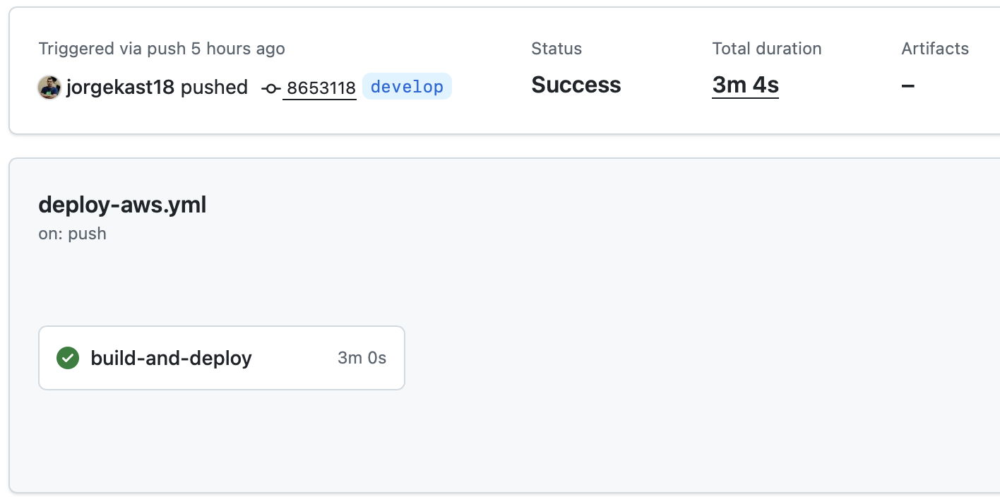
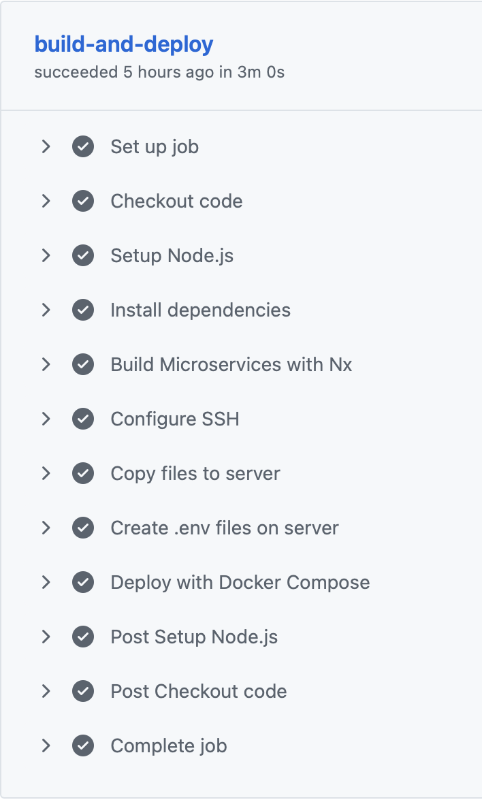
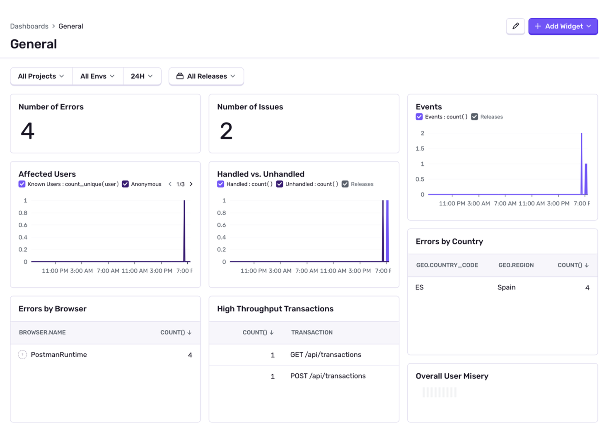
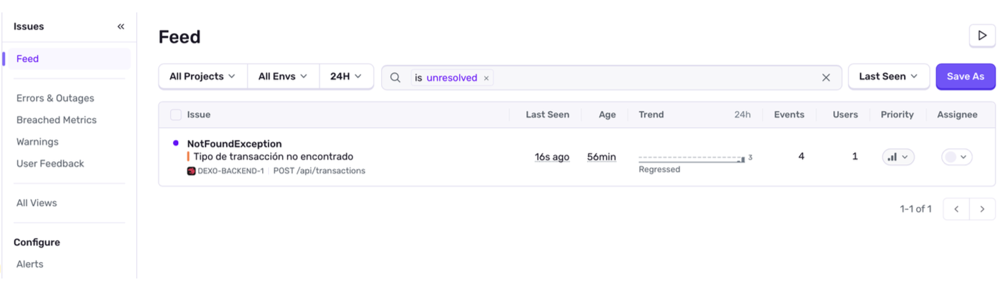
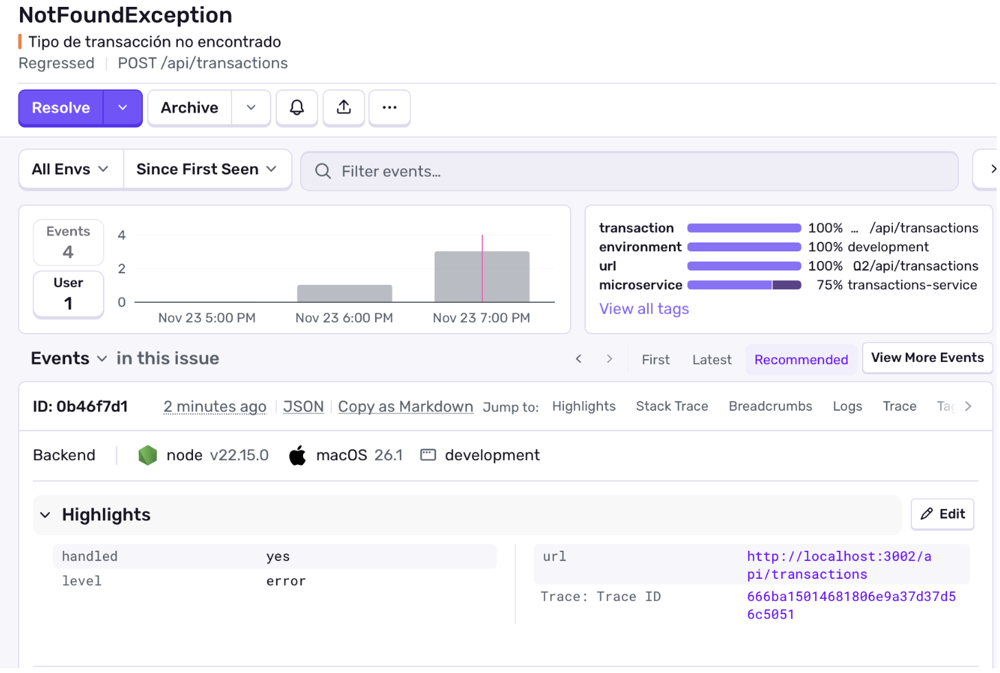
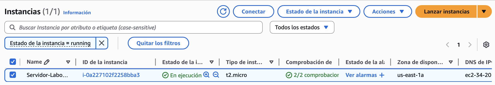
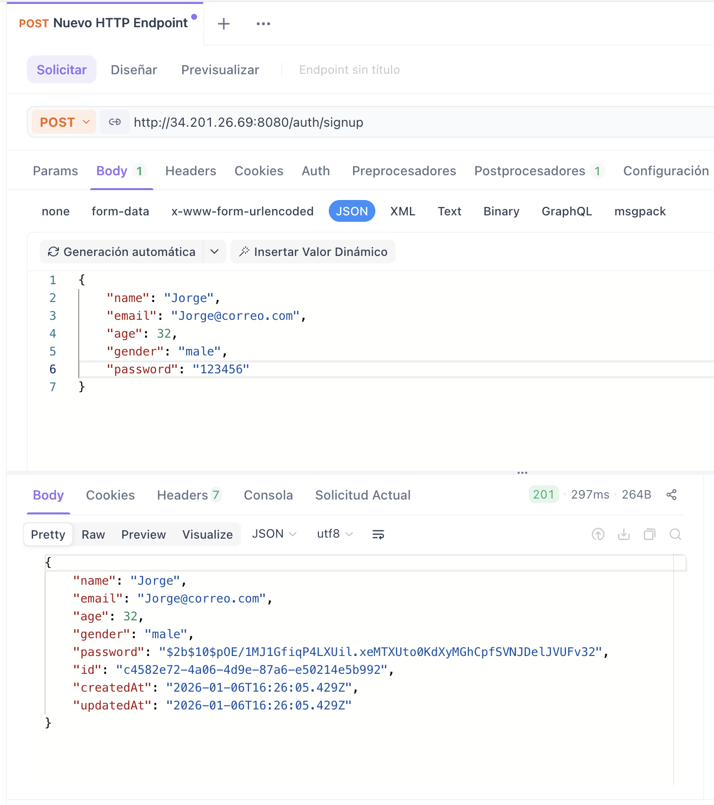
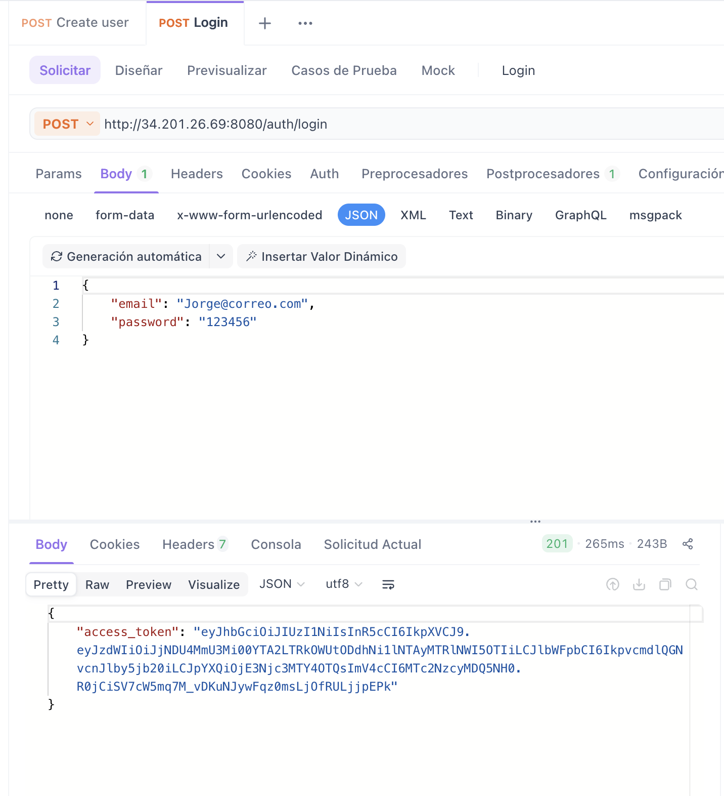
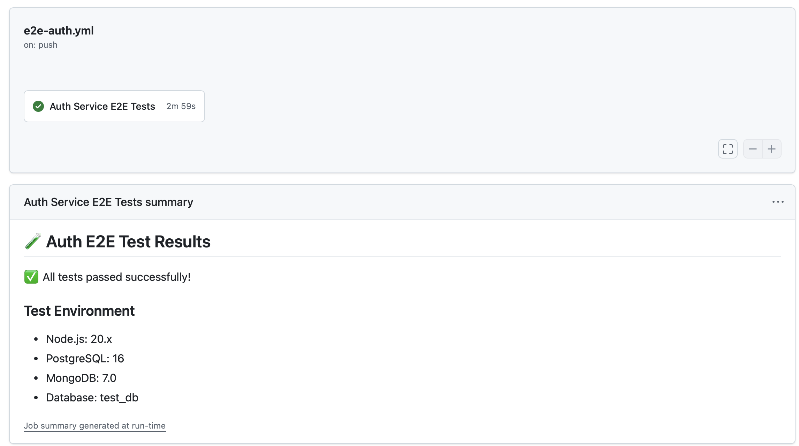

## Hito 5: Despliegue

# Elección del IaaS y Justificación:

Para este hito he tomado la decisión de usar **AWS** (Amazon Web Services) como proveedor de infraestructura como servicio (IaaS) para desplegar la aplicación. AWS es una plataforma ampliamente utilizada y confiable que ofrece una amplia gama de servicios y herramientas para gestionar y escalar aplicaciones en la nube.

Entre las opciones estaba:

- Oracle Cloud Infrastructure (OCI)
- Google Cloud Platform (GCP)
- Microsoft Azure
- Amazon Web Services (AWS)

La elección de AWS se basa en varios factores:

- **Madurez y Confiabilidad**: AWS es uno de los proveedores de nube más maduros y confiables del mercado, con una infraestructura global robusta y una amplia experiencia en la gestión de aplicaciones en la nube.
- **Amplia Gama de Servicios**: AWS ofrece una amplia gama de servicios que facilitan la implementación, gestión y escalabilidad de aplicaciones, incluyendo servicios de computación, almacenamiento, bases de datos, redes y seguridad.
- **Ecosistema y Comunidad**: AWS cuenta con un ecosistema vibrante y una comunidad activa que proporciona recursos, documentación y soporte para desarrolladores y empresas.
- **Integración con Herramientas de DevOps**: AWS se integra bien con herramientas de DevOps y CI/CD, lo que facilita la automatización del despliegue y la gestión de aplicaciones.
- **Facilidad de uso con Terraform**: AWS tiene un excelente soporte para Terraform, lo que permite gestionar la infraestructura como código de manera eficiente y reproducible.

# Herramientas utilizadas para el despliegue:

- **Docker**: Para la contenedorización de las aplicaciones, permitiendo empaquetar el código y sus dependencias en contenedores ligeros y portátiles.
- **Docker Compose**: Para definir y gestionar múltiples contenedores Docker, facilitando la orquestación de los servicios que componen la aplicación.
- **GitHub Actions**: Para la integración continua y el despliegue continuo (CI/CD), automatizando la construcción, prueba y despliegue de las aplicaciones.
- **Terraform**: Para la gestión de la infraestructura como código, permitiendo definir y provisionar los recursos de AWS de manera reproducible y escalable.

## Configuración de Docker Compose y Dockerfile Base:
Para la configuración de Docker Compose, he creado un archivo `docker-compose.yml` que define los servicios necesarios para ejecutar la aplicación. A continuación se muestra un ejemplo de configuración:


````yml
version: '3.8'

services:
  postgres:
    image: postgres:16
    container_name: dexo_postgres
    restart: always
    env_file: .env
    ports: ["5432:5432"]
    networks:
      - dexo_network
    healthcheck:
      test: ["CMD-SHELL", "pg_isready -U postgres -d dexo_db"]
      interval: 10s
      timeout: 5s
      retries: 5

  mongodb:
    image: mongo:8.0
    container_name: dexo-mongodb
    restart: always
    env_file: .env
    environment:
      MONGO_INITDB_ROOT_USERNAME: ${MONGO_USER}
      MONGO_INITDB_ROOT_PASSWORD: ${MONGO_PASSWORD}
      MONGO_INITDB_DATABASE: logging
    ports: ["27017:27017"]
    networks:
      - dexo_network

  auth:
    container_name: auth_service
    build:
      context: .
      dockerfile: apps/auth/Dockerfile
    ports: ["8080:${AUTH_PORT}"]
    env_file:
      - .env
      - apps/auth/.env
    environment:
      MONGO_URI: ${MONGO_URI}
      POSTGRES_HOST: postgres
      POSTGRES_USER: postgres
    depends_on:
      postgres: { condition: service_healthy }
      mongodb: { condition: service_started }
    networks:
      - dexo_network
    restart: always

  transaction:
    container_name: transaction_service
    build:
      context: .
      dockerfile: apps/transactions/Dockerfile
    ports: ["8081:${TRANSACTION_PORT}"]
    env_file:
      - .env
      - apps/transactions/.env
    environment:
      MONGO_URI: ${MONGO_URI}
      POSTGRES_HOST: postgres
      POSTGRES_USER: postgres
    depends_on:
      mongodb: { condition: service_started }
    networks:
      - dexo_network
    restart: always

networks:
  dexo_network:
    driver: bridge

````
## Dockerfile Base:

Luego, se define **Dockerfile.base** que sirve como plantilla para construir imágenes de Docker para diferentes microservicios. Este Dockerfile utiliza una imagen base de Node.js, instala las dependencias necesarias y copia el código fuente al contenedor.

````Dockerfile
FROM node:20-alpine

WORKDIR /app

# 1. Copiamos solo lo necesario para instalar dependencias de PRODUCCIÓN
COPY package*.json ./

# 2. Instalamos solo dependencias de producción (Mucho más rápido y ligero)
# Omitimos 'dev' porque TypeScript ya fue compilado a JS
RUN npm ci --omit=dev --legacy-peer-deps

# 3. Copiamos el código YA COMPILADO desde la carpeta 'dist' que subirá GitHub
# Asegúrate de que esta ruta coincida con la salida de tu build de Nx
COPY dist/apps/auth ./dist/apps/auth

# 4. Ajustamos permisos (opcional pero buena práctica)
RUN chown -R node:node /app
USER node

EXPOSE 3001

# 5. Ejecutamos directamente el archivo JS compilado
# Ajusta la ruta si tu main.js está en otro lugar dentro de dist
CMD ["node", "dist/apps/auth/main.js"]

````

## GitHub Actions:

Se define un actions para el despliegue automático de la aplicación utilizando GitHub Actions. Este action se activa en eventos de push y pull request a las ramas principales, y realiza las siguientes tareas:

- Construcción de las imágenes Docker para cada microservicio.
- Publicación de las imágenes en Docker Hub.
- Build de la aplicación utilizando Docker Compose.
- Conectarse a la instancia EC2 en AWS y desplegar la aplicación.

A continuación de muestra el actions creado para el despliegue de la aplicación:

```yml
name: Deploy Nx App to EC2

on:
  push:
    branches: [ "main", "develop" ]

jobs:
  build-and-deploy:
    runs-on: ubuntu-latest

    steps:
      - name: Checkout code
        uses: actions/checkout@v4
        with:
          fetch-depth: 0

      # 1. Instalar Node y dependencias
      - name: Setup Node.js
        uses: actions/setup-node@v4
        with:
          node-version: '20'
          cache: 'npm'

      - name: Install dependencies
        run: npm ci --legacy-peer-deps

      # 2. EJECUTAR EL BUILD DE NX (Aquí ocurre la magia)
      # Esto crea la carpeta 'dist/' con tus microservicios compilados
      - name: Build Microservices with Nx
        run: npx nx run-many --target=build --all --parallel

      # 3. Configurar SSH
      - name: Configure SSH
        run: |
          mkdir -p ~/.ssh/
          echo "${{ secrets.EC2_SSH_KEY }}" > ~/.ssh/id_rsa
          chmod 600 ~/.ssh/id_rsa
          ssh-keyscan -H ${{ secrets.EC2_HOST }} >> ~/.ssh/known_hosts

      # 4. Copiar archivos al servidor
      # IMPORTANTE: Ahora incluimos la carpeta 'dist/' que acabamos de crear
      - name: Copy files to server
        run: |
          rsync -avz --delete \
            --exclude '.git' \
            --exclude 'node_modules' \
            --exclude '.github' \
            -e "ssh -i ~/.ssh/id_rsa" \
            ./dist ./package.json ./package-lock.json ./docker-compose.yml ./apps \
            ${{ secrets.EC2_USER }}@${{ secrets.EC2_HOST }}:/home/ec2-user/app

      # 4.1 Crear archivos .env en el servido
      - name: Create .env files on server
        run: |
            ssh -i ~/.ssh/id_rsa ${{ secrets.EC2_USER }}@${{ secrets.EC2_HOST }} << 'EOF'
              cd /home/ec2-user/app

              # 1. Crear .env RAÍZ
              echo "${{ secrets.ENV_ROOT }}" > .env

              # 2. Crear .env para AUTH
              mkdir -p apps/auth
              echo "${{ secrets.ENV_AUTH }}" > apps/auth/.env

              # 3. Crear .env para TRANSACTION
              mkdir -p apps/transactions
              echo "${{ secrets.ENV_TRANSACTION }}" > apps/transactions/.env
            EOF

      # 5. Desplegar en el servidor
      - name: Deploy with Docker Compose
        run: |
          ssh -i ~/.ssh/id_rsa ${{ secrets.EC2_USER }}@${{ secrets.EC2_HOST }} << 'EOF'
            # 1. ACTUALIZACIÓN DE EMERGENCIA DE DOCKER
            sudo yum update -y
            sudo yum install -y docker

            # Instalar el plugin de Docker Compose V2 oficial (arregla el error de buildx)
            mkdir -p ~/.docker/cli-plugins/
            curl -SL https://github.com/docker/compose/releases/download/v2.24.0/docker-compose-linux-$(uname -m) -o ~/.docker/cli-plugins/docker-compose
            chmod +x ~/.docker/cli-plugins/docker-compose

            # Reiniciar servicio
            sudo service docker start

            # --- DESPLIEGUE ---
            cd /home/ec2-user/app

            # Usamos el comando nuevo 'docker compose' (sin guion) que usa el plugin V2
            sudo ~/.docker/cli-plugins/docker-compose down
            sudo ~/.docker/cli-plugins/docker-compose up -d --build --remove-orphans

            sudo docker image prune -f
          EOF


```

## Terraform:

Para gestionar la infraestructura en AWS, he utilizado Terraform para definir y provisionar los recursos necesarios, como la instancia EC2, el grupo de seguridad y las claves SSH. A continuación se muestra la configuración utilizada en Terraform:

```hcl
terraform {
  required_providers {
    aws = {
      source  = "hashicorp/aws"
      version = "~> 4.0"
    }
  }
}

provider "aws" {
  region = "us-east-1"
}

# --- 1. RED (Networking) - La parte nueva para arreglar tu error ---

# Creamos una red privada virtual (VPC)
resource "aws_vpc" "lab_vpc" {
  cidr_block           = "10.0.0.0/16"
  enable_dns_support   = true
  enable_dns_hostnames = true
  tags = { Name = "lab-vpc" }
}

# Creamos una puerta de enlace para salir a Internet
resource "aws_internet_gateway" "lab_igw" {
  vpc_id = aws_vpc.lab_vpc.id
  tags = { Name = "lab-igw" }
}

# Creamos una subred pública (donde vivirá tu servidor)
resource "aws_subnet" "lab_subnet" {
  vpc_id                  = aws_vpc.lab_vpc.id
  cidr_block              = "10.0.1.0/24"
  map_public_ip_on_launch = true # ¡Importante! Para que te de IP pública
  availability_zone       = "us-east-1a"
  tags = { Name = "lab-subnet" }
}

# Tabla de enrutamiento para permitir tráfico de internet
resource "aws_route_table" "lab_rt" {
  vpc_id = aws_vpc.lab_vpc.id

  route {
    cidr_block = "0.0.0.0/0"
    gateway_id = aws_internet_gateway.lab_igw.id
  }
  tags = { Name = "lab-rt" }
}

# Asociamos la tabla a nuestra subred
resource "aws_route_table_association" "lab_assoc" {
  subnet_id      = aws_subnet.lab_subnet.id
  route_table_id = aws_route_table.lab_rt.id
}

# --- 2. SEGURIDAD (Firewall) ---

resource "aws_security_group" "lab_sg" {
  name        = "lab_security_group"
  description = "Permitir SSH y trafico web"
  vpc_id      = aws_vpc.lab_vpc.id # <--- AQUI estaba el error, ahora le decimos explícitamente la VPC

  ingress {
    from_port   = 22
    to_port     = 22
    protocol    = "tcp"
    cidr_blocks = ["0.0.0.0/0"]
  }

  ingress { # Tu Microservicio 1
    from_port   = 8080
    to_port     = 8080
    protocol    = "tcp"
    cidr_blocks = ["0.0.0.0/0"]
  }

  ingress { # Tu Microservicio 2
    from_port   = 8081
    to_port     = 8081
    protocol    = "tcp"
    cidr_blocks = ["0.0.0.0/0"]
  }

  egress {
    from_port   = 0
    to_port     = 0
    protocol    = "-1"
    cidr_blocks = ["0.0.0.0/0"]
  }
}

# --- 3. INSTANCIA (Servidor) ---

resource "aws_instance" "lab_server" {
  ami           = "ami-0cff7528ff583bf9a" # Amazon Linux 2 (us-east-1)
  instance_type = "t2.micro"

  # Conectamos el servidor a la subred y firewall que acabamos de crear
  subnet_id              = aws_subnet.lab_subnet.id
  vpc_security_group_ids = [aws_security_group.lab_sg.id]

  user_data = file("install_docker.sh")

  tags = {
    Name = "Servidor-Laboratorio-Uni"
  }
}

output "server_ip" {
  value = aws_instance.lab_server.public_ip
}
```

En la siguiente imagen se muestra el despliegue exitoso de la aplicación en la instancia EC2 de AWS:



A continuación se detallan los pasos que sigue el actions para desplegar la aplicación:



# Observalibilidad:

Para la observalibilidad se ha implementado un sistema de logging centralizado utilizando MongoDB como base de datos para almacenar los logs generados por los microservicios. Cada microservicio envía sus logs a MongoDB, lo que permite un análisis y monitoreo centralizado de la aplicación.

Adicionalmente se ha implementado **Sentry** como herramienta de monitoreo de errores y rendimiento. Sentry permite capturar y rastrear errores en tiempo real, proporcionando información detallada sobre los fallos y ayudando a identificar y solucionar problemas rápidamente.

Con esto, se implementa el framework MELT (Metrics, Events, Logs, Traces) para asegurar una buena observalibilidad de la aplicación desplegada en AWS.

La imagen a continuación muestra el dashboard de Sentry con los errores capturados por los microservicios:



Además, se ha configurado la integración de Sentry con los microservicios para capturar errores y eventos relevantes. Esto permite un monitoreo proactivo y una respuesta rápida a cualquier problema que pueda surgir en la aplicación.

En la siguiente imagen se muestra un ejemplo de un error capturado por Sentry en uno de los microservicios:



En la siguiente imagen se muestra el detalle del error:



# Aplicación desplegada:

Se muestra a continuación la instancia de AWS con la aplicación desplegada y en funcionamiento:



La aplicación está accesible a través de la IP pública de la instancia EC2: http://34.201.26.69

Para el microservicio de Auth se usa el puerto 8080: http://34.201.26.69:8080/auth

Para el microservicio de Transactions se usa el puerto 8081: http://34.201.26.69:8081/api/transactions

# Pruebas de funcionamiento:

Se ha realizado pruebas utilizando la herramienta ApiDog para verificar el correcto funcionamiento de los microservicios desplegados en AWS.

### Prueba de Signup:


### Prueba de Login:


Las pruebas e2e siguen su funcionamiento normal desde el hito anterior:


